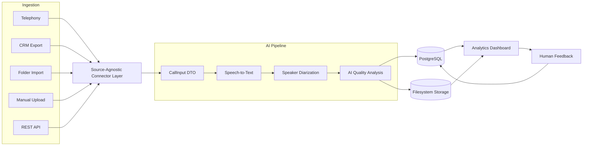

# FitNova – AI Sales Call Intelligence System

FitNova is an AI-powered Sales Call Intelligence platform that automatically processes sales conversations into structured, actionable insights. The system ingests call recordings from multiple sources, transcribes speech, identifies speakers, evaluates sales quality using AI, detects compliance issues, and presents results through interactive dashboards with a human feedback loop.

The application was designed as a modular, source-agnostic pipeline that can easily integrate with new telephony systems, CRM platforms, APIs, or storage providers without changing the core processing logic.

---

# Features

## Source-Agnostic Ingestion

FitNova separates data ingestion from processing using a connector-based architecture.

Currently implemented:
- Manual Upload

Architecture supports:
- Telephony platforms
- CRM exports
- REST APIs
- Folder watchers
- Additional connectors without pipeline modifications

Every connector converts incoming data into a standardized `CallInput` object before entering the processing pipeline.

---

## AI Processing Pipeline

Every uploaded call passes through the following stages:

```text
Audio Recording
      │
      ▼
Speech Transcription
(Faster Whisper / Gemini)
      │
      ▼
Speaker Diarization
(Pyannote / Gemini)
      │
      ▼
AI Quality Analysis
(Gemini Multi-Agent)
      │
      ▼
Issue Detection & Evidence Extraction
      │
      ▼
Storage
      │
      ▼
Dashboard & Human Review
```

Each stage is isolated and independently replaceable, allowing future improvements without affecting the rest of the pipeline.

---

# System Architecture



---

# AI Analysis

The conversation is evaluated using multiple AI agents.

Each call is scored across:

- Needs Discovery
- Rapport Building
- Objection Handling
- Compliance
- Closing Effectiveness

The system produces:

- Overall Quality Score
- Category Scores
- Strengths
- Weaknesses
- Coaching Recommendations
- Compliance Violations
- Timestamped Evidence

Every detected issue is linked to the exact transcript segment that caused it, making AI decisions transparent and reviewable.

---

# Human Feedback Loop

AI decisions are not treated as final.

Human reviewers can:

- Approve findings
- Dismiss findings
- Mark false positives
- Add reviewer comments

Feedback is stored separately and can later be used to improve prompts or retrain downstream models.

---

# Organization Model

The platform supports scalable organizational hierarchies.

```text
Organization
    │
    ├── Team
    │      │
    │      ├── Advisor
    │      │       │
    │      │       └── Calls
```

New organizations, teams, and advisors can be added dynamically without modifying application code.

---

# Storage Design

FitNova separates structured data from large artifacts.

## PostgreSQL

Stores:

- Organizations
- Teams
- Advisors
- Calls
- Analyses
- Issue Tags
- Human Feedback
- Ingestion Sources

## Filesystem

Stores:

- Raw Audio
- Transcript JSON
- Conversation JSON
- Analysis JSON
- Processing Timeline

This hybrid storage approach keeps relational queries efficient while preserving complete audit artifacts.

---

# Dashboard

The dashboard surfaces actionable insights rather than raw data.

Visualizations include:

- KPI Summary
- Quality Score Trends
- Advisor Leaderboard
- Team Performance Comparison
- Radar Chart (Sales Skills)
- Compliance Heatmap
- Violation Severity Distribution
- Human Feedback Analytics
- Recent Call Activity

Global filters:

- Organization
- Team
- Advisor
- Date
- Ingestion Source

---

# Technology Stack

Backend

- FastAPI
- SQLAlchemy 2.0
- Alembic
- PostgreSQL

Frontend

- Streamlit
- Plotly

AI

- Google Gemini
- Faster Whisper
- Pyannote.audio

Utilities

- Mutagen
- Pydantic v2

Testing

- Pytest

---

# Quick Start

## Clone

```bash
git clone https://github.com/tony-pawan/fitnova-call-intelligence.git
cd fitnova-call-intelligence
```

## Create Virtual Environment

```bash
python -m venv .venv
```

Windows

```bash
.venv\Scripts\activate
```

Linux/macOS

```bash
source .venv/bin/activate
```

## Install Dependencies

```bash
pip install -r requirements.txt
```

## Configure Environment

```bash
copy .env.example .env
```

Configure:

- DATABASE_URL
- GEMINI_API_KEY
- PYANNOTE_AUTH_TOKEN

---

## Initialize Database

```bash
python backend/app/database/init_db.py
```

---

## Run Backend

```bash
uvicorn backend.app.main:app --reload
```

---

## Run Frontend

```bash
streamlit run frontend/Home.py
```

---

# Running Tests

```bash
python -m pytest backend/tests/
```

---

# Real vs Mocked Components

## Real

- FastAPI backend
- Streamlit frontend
- SQLAlchemy ORM
- PostgreSQL persistence
- Gemini analysis
- Faster Whisper transcription
- Pyannote diarization
- Dashboard analytics
- Human feedback workflow

## Mock Fallbacks

When external AI services are unavailable:

- Deterministic Gemini responses
- Mock diarization
- Mock transcripts

allow the application to continue functioning for demonstrations and testing.

---

# Design Trade-offs

Several engineering decisions were made to keep the project focused while maintaining extensibility.

- Implemented Manual Upload while designing for multiple ingestion sources.
- Used asynchronous background processing instead of real-time streaming.
- Used local filesystem storage instead of cloud object storage.
- Stored reviewer feedback without implementing automatic model retraining.
- Chose a modular pipeline so individual AI components can be replaced independently.

---

# Edge Cases Considered

The system handles:

- Mixed English/Hindi conversations
- Poor audio quality
- Long recordings
- Missing AI credentials
- API failures
- Duplicate uploads
- Speaker diarization failures
- Human disagreement with AI findings

---

# Known Limitations

- Heavy speaker overlap can reduce diarization accuracy.
- AI quality depends on the underlying language model.
- Manual Upload is the only fully implemented connector.
- Filesystem storage should be replaced by cloud object storage for production.
- A distributed task queue (Celery/RabbitMQ) would be preferable for large-scale deployments.

---

# Future Improvements

- Real-time streaming transcription
- Cloud object storage (AWS S3 / Azure Blob)
- JWT Authentication
- Automatic model retraining from reviewer feedback
- Support for additional LLM providers
- Live coaching during calls

---

# License

MIT License
