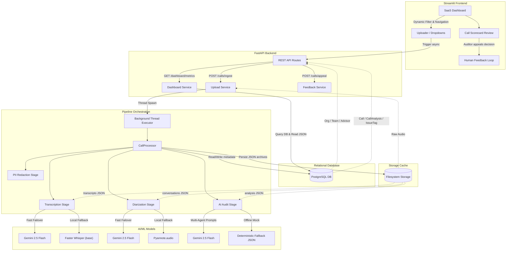

# FitNova - Sales Call Intelligence System

FitNova is an enterprise conversational intelligence and compliance auditing platform designed for high-performance sales teams. It automates speech transcription, speaker diarization (separating sales advisors vs. prospective clients), Gemini-driven quality evaluations, structured script compliance audits, and advisor feedback appeal workflows.

---

## 🚀 Quick Start

Follow these steps to clone, configure, and launch the application:

```bash
# 1. Clone the repository
git clone https://github.com/your-username/fitnova-sales-call-intelligence.git
cd fitnova-sales-call-intelligence

# 2. Set up virtual environment
python -m venv .venv
# On Windows:
.\.venv\Scripts\activate
# On macOS/Linux:
source .venv/bin/activate

# 3. Install dependencies
pip install -r requirements.txt

# 4. Copy environment configuration
copy .env.example .env
# Note: Open .env and configure your GEMINI_API_KEY and Hugging Face PYANNOTE_AUTH_TOKEN

# 5. Initialize the database and seed demo data
python backend/app/database/init_db.py

# 6. Start the FastAPI backend
uvicorn backend.app.main:app --host 127.0.0.1 --port 8000 --reload

# 7. Start the Streamlit frontend (in a separate terminal)
streamlit run frontend/Home.py
```

---

## ⚡ System Architecture

The workflow moves sequentially from speech upload to multi-stage pipeline processing, database persistence, and filesystem caching.



---

## 📋 Features

*   **Audio Ingestion**: Drag-and-drop file upload supporting `.wav`, `.mp3`, and `.m4a` files with Mutagen metadata duration parsing.
*   **Background Pipeline**: Async FastAPI background tasks status tracker mapping states: `Uploaded` ➔ `Queued` ➔ `Processing` ➔ `Completed`/`Failed`.
*   **Speech-to-Text**: High-speed, local transcription using optimized **Faster Whisper**.
*   **Speaker Diarization**: Multi-speaker alignment separating `Advisor` and `Customer` turns using **Pyannote.audio**.
*   **Compliance Audits**: Multi-agent LLM framework (Google Gemini) rating calls and highlighting compliance issue tags.
*   **Dispute Appeals**: Formal lifecycle workflow for advisors to appeal issue flags, routed to manager review queues.
*   **Dynamic Visualizations**: Manager leaderboards, performance histograms, and pie charts built with **Plotly Express**.

---

## 🛠️ Technology Stack

*   **Backend API**: FastAPI, Uvicorn
*   **Frontend UI**: Streamlit
*   **Database & ORM**: PostgreSQL / SQLite, SQLAlchemy 2.0, Alembic migrations
*   **Audio Processing**: Mutagen
*   **Machine Learning Models**: Faster Whisper (speech-to-text), Pyannote.audio (speaker diarization)
*   **LLM Orchestrations**: Google Gemini (1.5-flash)
*   **Visualizations**: Plotly Express
*   **Testing**: Pytest

---

## 📂 Project Structure

```text
fitnova/
├── backend/
│   ├── alembic/              # Database migration version files
│   ├── app/                  # Application source package
│   │   ├── api/              # API router and endpoints
│   │   ├── core/             # Base settings & logging configs
│   │   ├── database/         # Session local and initialization seeder scripts
│   │   ├── models/           # SQLAlchemy ORM models definitions
│   │   ├── schemas/          # Validation Pydantic schemas
│   │   ├── services/         # Business layer services (Upload, Dashboard, Appeals)
│   │   ├── pipeline/         # Orchestrator and background tasks trigger
│   │   ├── ai/               # AI models (Whisper, Pyannote, Gemini)
│   │   └── utils/            # Storage and json helpers
│   └── tests/                # Automated pytest suite (37 tests)
├── docs/                     # Visual assets folder
│   └── architecture.mermaid  # System architecture Mermaid flowchart source
├── frontend/
│   ├── Home.py               # Streamlit homepage portal
│   ├── sidebar.py            # Central navigation and authentication switches
│   └── pages/                # Streamlit multi-page registries
└── storage/                  # Decoupled filesystem cache (.gitkeep inside)
    ├── audio/
    ├── transcripts/
    ├── conversations/
    ├── analysis/
    └── processed/
```

---

## 🔧 Environment Variables

Configure the following parameters in your `.env` file (copied from `.env.example`):

*   `DATABASE_URL`: PostgreSQL connection string (defaults to local config).
*   `GEMINI_API_KEY`: Google Gemini platform developer API key.
*   `PYANNOTE_AUTH_TOKEN`: Hugging Face read access token to download Pyannote pipelines.
*   `WHISPER_MODEL`: Local Whisper size model (`base`, `tiny`, `small`).
*   `WHISPER_DEVICE`: Local device execution mapping (`cpu` or `cuda`).

---

## 🧪 Running Tests

To run the complete automated test suite (36 tests covering DB operations, upload file limits, background pipeline state machines, transcription, diarization, Gemini scorecards, and appeals updates):

```bash
python -m pytest backend/tests/
```

---

## 🔍 Real vs. Mocked Components

### Real Components (Production Mode)
*   **FastAPI Backend & Streamlit Frontend**: Direct inter-process integration communicating via REST API and database queries.
*   **Database Persistence**: Structured relational schemas (Organization, Team, Advisor, Call, CallAnalysis, IssueTag) implemented via SQLAlchemy and PostgreSQL.
*   **Speech-to-Text**: Native transcription via Google Gemini 2.5 Flash with fallback to local **Faster Whisper** execution.
*   **Speaker Diarization**: Multi-speaker indexing and alignment using Gemini 2.5 Flash with fallback to **Pyannote.audio** diarization.
*   **Compliance Audits**: Multi-agent compliance audits executing prompt evaluations on Gemini 2.5 Flash.
*   **Appeals & Appeals Loop**: Live updates, score overrides, and database updates from the auditor decision loop.
*   **Dashboard Analytics**: Real-time aggregations (Leaderboard, Heatmap, Team Comparison, and Feedback analytics) calculated dynamically from Postgres and filesystem JSON storage.

### Mocked Components (Fallback & Offline Mode)
*   **Gemini Client**: When `GEMINI_API_KEY` is set to `"mock_key_for_development"` or when API quotas are exceeded, the API client automatically falls back to deterministic mock JSON schemas.
*   **Speaker Diarization**: When Hugging Face authorization tokens are missing or the local `pyannote/speaker-diarization-3.1` model files are missing, the system falls back to a deterministic time-division mock diarization SPEAKER_00 / SPEAKER_01 alternate mapping.
*   **PII Redaction**: Placeholder stage that logs event timelines without modifying transcript payloads.

---

## ⚠️ Known Limitations
*   **NumPy 2.x Conflict with Pyannote**: On some environments, Pyannote/SciPy dependencies trigger a NumPy `module 'numpy' has no attribute 'long'` error. The system handles this gracefully by falling back to mock diarization.
*   **Rate-Limiting on Free-Tier Keys**: Gemini API keys on the free tier are subject to strict per-minute and per-day request limits. Using a paid tier/developer key resolves all limit-based fallbacks.
*   **Asynchronous Execution Threading**: In non-testing environments, the call processing runs inside background daemon threads. A complete distributed queue system (like Celery/Redis) is recommended for production scaling.

---

## 🚀 Future Improvements
1.  **JWT Authentication**: Incorporate active security tokens and role-based permissions validation.
2.  **Appeal Notifications**: Notify advisors automatically when managers resolve disputes.
3.  **Real-Time Pipelines**: Transition uploader pipelines to streaming WebSockets for live transcript rendering.

---

## 📄 License
This project is licensed under the MIT License.
